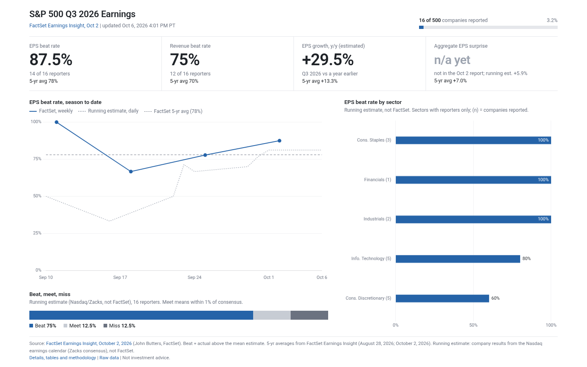

# S&P 500 Q3 2026 Earnings Scorecard

A static page that tracks the Q3 2026 S&P 500 earnings season. FactSet's weekly Earnings Insight is the
headline standard; a daily running estimate built from company-level results fills the days between
FactSet reports. A GitHub Actions cron rebuilds the page twice each weekday and commits the updated data and site.



## Layout

`docs/index.html` is a one-screen summary that fits a 1280x720 or 1440x900 desktop viewport without
scrolling (it stacks and scrolls on phones):

- title, FactSet report date with a link to the PDF, last update time (PT), and a progress bar of companies
  reported
- four FactSet tiles: EPS beat rate, revenue beat rate, EPS growth (estimated or blended), aggregate EPS
  surprise ("n/a yet" until FactSet states it), each with its FactSet 5-year average beneath
- three small charts: EPS beat rate by week (FactSet weekly points, running estimate as a dotted line,
  5-year average as a dashed line), a beat / meet / miss bar, and EPS beat rate by sector (running estimate,
  sectors with reporters only)
- a short footer with citations and any stale warning

Everything else (side-by-side table, running-estimate cards, sector table, top beats and misses, all
reporters, methodology) is on `docs/details.html`, linked from the footer.

## What it shows

### FactSet official scorecard (headline)

Parsed from the latest free FactSet Earnings Insight PDF, with "as of FactSet Earnings Insight, <date>"
and a link to the PDF:

- share of the S&P 500 that has reported
- share beating EPS estimates and share beating revenue estimates (FactSet: actual above the mean
  estimate by any amount)
- aggregate EPS surprise and aggregate revenue surprise
- blended EPS growth and blended revenue growth, year over year (FactSet calls these "estimated" before
  results start arriving)
- FactSet's 5-year and 10-year averages for each of those

A field the report does not state is shown as "n/a, not stated in this report"; nothing is filled in.
Very early in a season FactSet gives counts ("14 S&P 500 companies have reported a positive EPS
surprise" out of 16) rather than percentages; the page then shows the counts and the percentage computed
from them, and says so.

### Running estimate since FactSet's last report (secondary, clearly labelled "Not FactSet")

Built every run from the Nasdaq earnings calendar (Zacks consensus) for every S&P 500 company that has
reported this season:

- companies reported, and how many reported on or after FactSet's report date
- **EPS above consensus by any amount** (FactSet's definition) as the headline beat rate, with the
  plus or minus 1% beat / meet / miss split as detail (`meet_band_pct` in `config.json`)
- aggregate EPS surprise, weighted by shares outstanding, and the median company surprise
- revenue above consensus and aggregate revenue surprise, only with a `FINNHUB_API_KEY` secret
- blended EPS growth (actuals for reporters, consensus for the rest, against year-ago EPS), when at
  least `min_growth_coverage` companies (default 350) have both numbers

### Also

- a side-by-side table: FactSet, running estimate, FactSet 5-yr and 10-yr averages
- season-to-date charts of the EPS beat rate and aggregate EPS surprise: FactSet's weekly points as the
  official series (dark), the daily running estimate as a lighter line, and the averages as dashed lines
- sector table (GICS), top 10 EPS beats and misses, and every reporter (running estimate data)
- last updated time in Pacific time and source attribution

## Benchmarks (5-yr and 10-yr averages)

Each average is taken from the latest FactSet report that states it. If the latest report does not
state one (early-season reports usually give only the growth averages), the page falls back to the values
cited in `config.json` under `benchmarks_fallback`, from the
[FactSet Earnings Insight of August 28, 2026](https://go.factset.com/hubfs/Website/Resources%20Section/Research%20Desk/Earnings%20Insight/EarningsInsight_082826.pdf)
(EPS beat 78% / 76%, EPS surprise 7.0% / 7.4%, revenue beat 70% / 68%, revenue surprise 1.9% / 1.6%).
The footer and the note under the FactSet cards name the report each average came from.

## Data sources

| Need | Source | Key? |
| --- | --- | --- |
| Headline scorecard and averages | FactSet Earnings Insight PDF, `https://go.factset.com/hubfs/Website/Resources%20Section/Research%20Desk/Earnings%20Insight/EarningsInsight_MMDDYY.pdf` (`advantage.factset.com` serves the same path and is tried second) | No |
| EPS actual, consensus, report date, fiscal quarter, year-ago EPS | Nasdaq earnings calendar, `api.nasdaq.com/api/calendar/earnings?date=YYYY-MM-DD` | No |
| Shares outstanding (weights) | Nasdaq stock screener, market cap divided by last sale | No |
| Revenue actual and consensus | Finnhub earnings calendar, `finnhub.io/api/v1/calendar/earnings` | Yes, free tier |
| S&P 500 members and GICS sectors | [datasets/s-and-p-500-companies](https://github.com/datasets/s-and-p-500-companies), cached in `data/sp500_constituents.csv` | No |

**FactSet.** FactSet publishes the report weekly, usually on Friday, dated in the file name. Each run walks
back from today one weekday at a time (up to 21 days, so a holiday-week Thursday release is found too),
downloads the newest PDF it has not parsed yet, and reads it with pdfplumber. Parsed reports are kept in
`data/factset.json`. On the first run of a season it also collects the earlier weekly reports of the
season for the chart. If the newest report cannot be downloaded or read, the last good values stay on the
page with a stale warning. The parser was checked against 13 reports (Q3 2025, Q2 2026, Q3 2026).

**Nasdaq.** No key; one request per calendar day; gives actual EPS, consensus, number of estimates and
fiscal quarter, and for upcoming reports the year-ago EPS (split-adjusted). No revenue. Needs
browser-like headers, which the script sends. Its consensus is Zacks', not FactSet's.

**Finnhub (optional).** Free plan, includes revenue actual and estimate; serves about a month of history,
so every row seen is stored in `data/finnhub_rows.json`.

**Not used:** Unusual Whales' earnings endpoints have EPS but no revenue estimate and need a paid key;
Financial Modeling Prep needs a key; Alpha Vantage's free tier (25 calls a day) is too small.

### Revenue secret (optional)

Create a free key at finnhub.io, then from the repo folder:

```
gh secret set FINNHUB_API_KEY
```

`gh` prompts for the value. The key is read only from the environment and never written to the repo.

## Methodology and caveats (running estimate)

- **Season membership.** A company is in the Q3 2026 season if Nasdaq lists its fiscal quarter as ending in
  Aug, Sep or Oct 2026, matching how FactSet maps fiscal quarters to calendar Q3 (Oracle and Nike count;
  Broadcom's July quarter does not). Calendar window: Sep 1 to Dec 15, 2026.
- **Share classes.** GOOGL/GOOG, FOXA/FOX and NWSA/NWS count once each: 500 companies, 503 tickers.
- **Consensus differs from FactSet.** Nasdaq republishes Zacks consensus and Zacks-adjusted actuals, so the
  running estimate will not match FactSet exactly. On Oct 2, 2026 both counted 16 reporters; FactSet had
  14 above estimate, the running estimate 13.
- **Surprise percent** is (actual - estimate) / |estimate|. The top 10 tables skip consensus below $0.10.
- **Year-ago EPS** comes from Nasdaq's pre-report "last year's EPS" (split-adjusted), else the year-ago
  calendar actual (not split-adjusted) for companies that reported before collection started. Spin-offs and
  one-time items can move single companies a lot.
- **Weights** use current shares outstanding, not quarter-average diluted shares.
- **History.** `data/history.csv` has one row per run day; `replay` rows were rebuilt from report dates for
  the days before the first scheduled run.

## Failure handling

- Every request has a timeout and retries. Nasdaq calendar days that fail keep their cached rows.
- If Nasdaq fails outright (for example if it blocks the runner's IP), the previous running estimate stays
  with a stale warning; the FactSet section still updates.
- If FactSet's newest report cannot be fetched or parsed, the last good FactSet values stay with a stale
  warning.

## Schedule

| UTC | Pacific (PDT, to Nov 1) | Pacific (PST, from Nov 1) | Why |
| --- | --- | --- | --- |
| 14:47 Mon-Fri | 7:47 AM | 6:47 AM | after pre-market reports; picks up Friday's FactSet report |
| 01:17 Tue-Sat | 6:17 PM previous day | 5:17 PM previous day | after after-close reports |

Also on demand (`workflow_dispatch`). Each run commits changed files in `data/` and `docs/` as
`github-actions[bot]`. GitHub Pages is not used: a private repository on the free plan cannot enable it.

## Run locally

```
python3 -m venv .venv && . .venv/bin/activate
pip install -r requirements.txt
python scripts/update.py
python3 -m http.server -d docs 8000
```

## Files

- `scripts/update.py` fetches and computes; `scripts/factset.py` finds and parses the FactSet PDF;
  `scripts/render.py` writes `docs/index.html` (summary) and `docs/details.html`;
  `python scripts/render.py` re-renders from the saved data without fetching anything.
- `config.json`: season window, quarter mapping, meet band, FactSet lookback, fallback averages.
- `data/factset.json`: every parsed FactSet report this season. `data/q3_2026.json`: the full computed
  scorecard. `data/history.csv`: daily running-estimate series. `data/nasdaq_days.json`, `data/shares.json`,
  `data/finnhub_rows.json`: source caches.
- `publish.sh` commits, creates `condortango/q3-earnings-scorecard`, pushes, and starts the first run.
  Run it only when you are ready.

FactSet Earnings Insight is published by FactSet Research Systems; this page quotes its headline figures
and links to the source report. Not investment advice.
